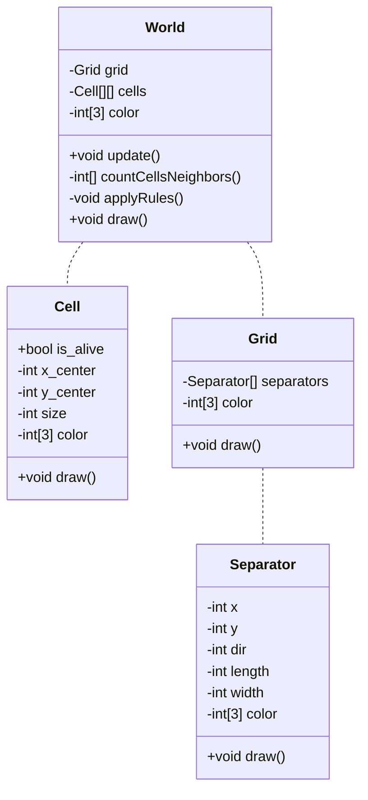

# Life Variations

A website that displays variations of Conway's Game of Life according to user setup.

## Class Diagram

```mermaid
classDiagram
    World .. Cell
    World .. Grid
    Grid .. Separator

    World : -Grid grid
    World : -Cell[][] cells
    World : -int[3] color
    World : +void update()
    World : -int[] countCellsNeighbors()
    World : -void applyRules()
    World : +void draw()

    Grid : -Separator[] separators
    Grid : -int[3] color
    Grid : +void draw()

    Cell : +bool is_alive
    Cell : -int x_center
    Cell : -int y_center
    Cell : -int size
    Cell : -int[3] color
    Cell : +void draw()

    Separator : -int x
    Separator : -int y
    Separator : -int dir
    Separator : -int length
    Separator : -int width
    Separator : -int[3] color
    Separator : +void draw()
```